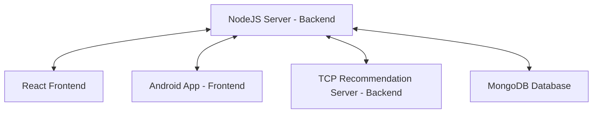
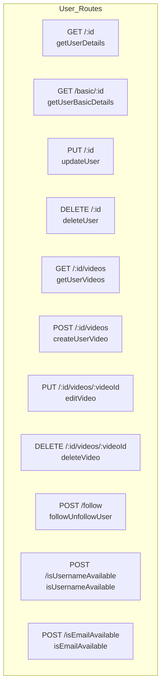
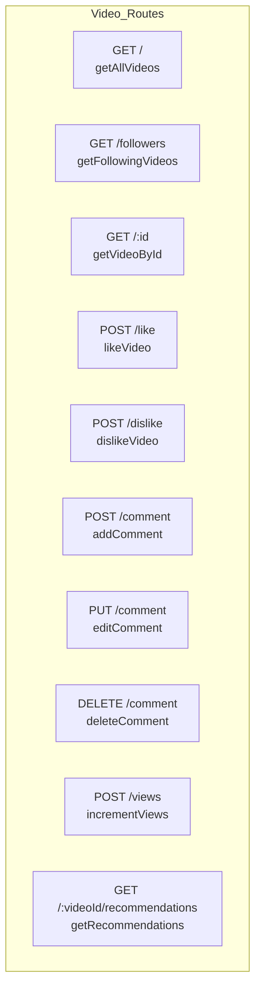

# Crispy Crumbs: NodeJS server with MongoDB database

Welcome to the **Crispy Crumbs** backend. This server is built using NodeJS integrated with MongoDB to provide a robust backend for the Crispy Crumbs video sharing platform.

## Crispy Crumbs - Founders

- Ofek Avan Danan (211824727)
- Zohar Mzhen (314621806)
- Dolev Menajem (207272220)

## Running the Crispy Crumbs Server

### Prerequisites

- The server is built and tested to run from a Windows machine.
- Node.js
- MongoDB
  - By default, CrispyCrumbs will use the "CrispyCrumbs" database in "mongodb://localhost:27017/CrispyCrumbs" connection **and will overwrite anything in it**.
- **TCP Recommendation Server**: The TCP server is necessary for video recommendations. Activate the [C++ TCP Server](https://github.com/Mzhenian/CrispyCrumbsTCP) according to the instructions provided in the repository before starting the Node.js server. Without it, the server will display random videos in the suggested videos section.

### Download

- Download [CrispyCrumbsServer](https://github.com/Mzhenian/CrispyCrumbsServer) and unzip it.
- **Or** [clone](https://github.com/Mzhenian/CrispyCrumbsServer.git) the repository.

### Initialization Option One: Easy & Fast Script

**Note:** If you're interested in using the website quickly, you can run the CrispyCrumbs website initialization script, which will also initialize the server without updating the JWT secret.

1. Open a command prompt in the `CrispyCrumbsServer` project folder.
2. Run: `.\init_server.cmd`
3. You can update the CrispyCrumbs server JWT secret if prompted (it's a password that doesn't need to be remembered, only replaced when necessary).

- After initialization, use `npm start` to start the server.

### Initialization Option Two: Manually

#### JWT Secret

1. Open `CrispyCrumbsServer\config\config.js` file and choose a new JWT secret key:

   ```javascript
   // config/config.js
   module.exports = {
       jwtSecret: 'your-jwt-secret-here', // Replace this with your actual secret key
       // other configurations...
   };
   ```

#### MongoDB

1. Open MongoDB Compass.
2. Connect to the URI `mongodb://localhost:27017/CrispyCrumbs`.
3. Open or create a database named `CrispyCrumbs`.
4. Open or create two collections: `users` and `videos`.
5. Ensure `users` and `videos` are empty.
6. In `users`, select `ADD DATA > IMPORT JSON OR CSV FILE`.
7. Choose `CrispyCrumbsServer\FilesForMongoDB\CrispyCrumbs.users.json`.
8. In `videos`, select `ADD DATA > IMPORT JSON OR CSV FILE` and choose `CrispyCrumbsServer\FilesForMongoDB\CrispyCrumbs.videos.json`.
9. Go to the `indexes` tab and create the following indexes:
   a. On fields `title` and `description` of type `text`;
   b. On field `title` of type `1 (asc)`;
   c. On field `tags` of type `1 (asc)`.

#### The Server

1. Open a terminal in the `CrispyCrumbsServer` project folder.
2. Run `npm install`.
3. **Activate the C++ TCP server according to the instructions on the repository.** This is necessary for video recommendations.
4. Run `node server.js`. Now the server should be running!

## Running the Crispy Crumbs Frontend

### Web Version

- Clone or download the [CrispyCrumbsWeb](https://github.com/Mzhenian/CrispyCrumbsWeb) repository.
- Follow the instructions in the repository to set up and run the web version of Crispy Crumbs.

### Android Version

- Clone or download the [CrispyCrumbsAndroid](https://github.com/Mzhenian/CrispyCrumbsAndroid) repository.
- Follow the instructions in the repository to set up and run the Android version of Crispy Crumbs.

## Crispy Crumbs Project setup



## Public Routes Overview

### User Routes

- **Get User Details**
  - `GET /:id`
  - Function: `getUserDetails`
  - Description: Retrieves detailed information about a user.

- **Get Basic User Details**
  - `GET /basic/:id`
  - Function: `getUserBasicDetails`
  - Description: Retrieves basic information about a user.

- **Update User**
  - `PUT /:id`
  - Function: `updateUser`
  - Description: Updates user details. Requires authentication and user verification.

- **Delete User**
  - `DELETE /:id`
  - Function: `deleteUser`
  - Description: Deletes a user along with all their data. Requires authentication and user verification.

- **Get User Videos**
  - `GET /:id/videos`
  - Function: `getUserVideos`
  - Description: Retrieves videos uploaded by a user.

- **Upload Video**
  - `POST /:id/videos`
  - Function: `createUserVideo`
  - Description: Uploads a new video. Requires authentication and user verification.

- **Edit Video**
  - `PUT /:id/videos/:videoId`
  - Function: `editVideo`
  - Description: Edits an existing video. Requires authentication and user verification.

- **Delete Video**
  - `DELETE /:id/videos/:videoId`
  - Function: `deleteVideo`
  - Description: Deletes a video. Requires authentication and user verification.

- **Authentication and Validation**
  - `POST /validateToken`
    - Function: `validateToken`
    - Description: Validates the JWT token.
  
  - `POST /tokens`
    - Function: `login`
    - Description: Logs in a user and provides a JWT token.

  - `POST /`
    - Function: `signup`
    - Description: Signs up a new user.

- **Follow/Unfollow User**
  - `POST /follow`
  - Function: `followUnfollowUser`
  - Description: Follows or unfollows a user. Requires authentication and user verification.

- **Check Username/Email Availability**
  - `POST /isUsernameAvailable`
    - Function: `isUsernameAvailable`
    - Description: Checks if a username is available.

  - `POST /isEmailAvailable`
    - Function: `isEmailAvailable`
    - Description: Checks if an email is available.
   


### Video Routes

- **Get All Videos**
  - `GET /`
  - Function: `getAllVideos`
  - Description: Retrieves all videos including most viewed, recent, following, and random videos.

- **Get Following Videos**
  - `GET /followers`
  - Function: `getFollowingVideos`
  - Description: Retrieves videos from followed users. Requires authentication.

- **Get Video by ID**
  - `GET /:id`
  - Function: `getVideoById`
  - Description: Retrieves a video by its ID.

- **Like/Dislike Video**
  - `POST /like`
    - Function: `likeVideo`
    - Description: Likes a video. Requires authentication and user verification.

  - `POST /dislike`
    - Function: `dislikeVideo`
    - Description: Dislikes a video. Requires authentication and user verification.

- **Add/Edit/Delete Comment**
  - `POST /comment`
    - Function: `addComment`
    - Description: Adds a comment to a video. Requires authentication and user verification.

  - `PUT /comment`
    - Function: `editComment`
    - Description: Edits a comment. Requires authentication and user verification.

  - `DELETE /comment`
    - Function: `deleteComment`
    - Description: Deletes a comment. Requires authentication and user verification.

- **Increment Video Views**
  - `POST /views`
  - Function: `incrementViews`
  - Description: Increments video views, updates user watch history, and sends the update to the recommendation server.

- **Get Video Recommendations**
  - `GET /:videoId/recommendations`
  - Function: `getRecommendations`
  - Description: Retrieves recommended videos based on watch history and video popularity. Requires the TCP server to be running for full functionality.



### Miscellaneous

- **Check Following Status**
  - `POST /isFollowing`
  - Function: `isFollowing`
  - Description: Checks if the user is following another user. Requires authentication.

- **Verify Token Middleware**
  - `verifyToken`
  - Description: Middleware to verify JWT token.

- **Verify User ID Middleware**
  - `verifyUserId`
  - Description: Middleware to verify if the user ID in the request matches the user ID from the token.

## Work Process

Our project was a collaborative effort. We initially met to plan and divided tasks using Jira. The journey was both educational and enjoyable.

  [Jira Missions](https://crispycrumbs.atlassian.net/jira/software/projects/SCRUM/list?sortBy=customfield_10020&direction=ASC)
