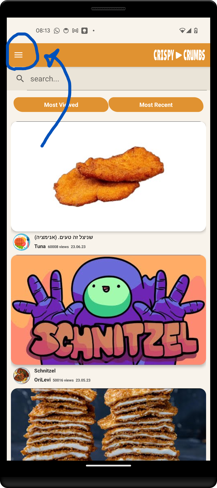
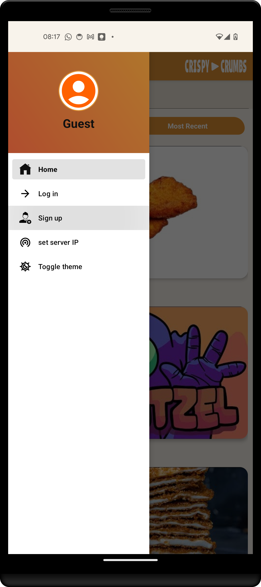
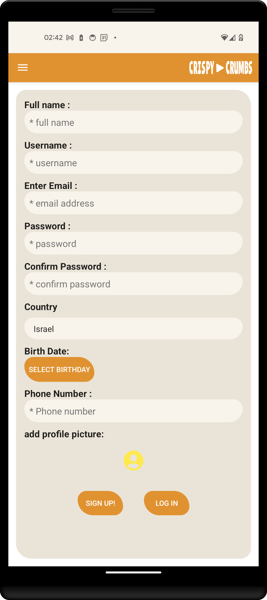
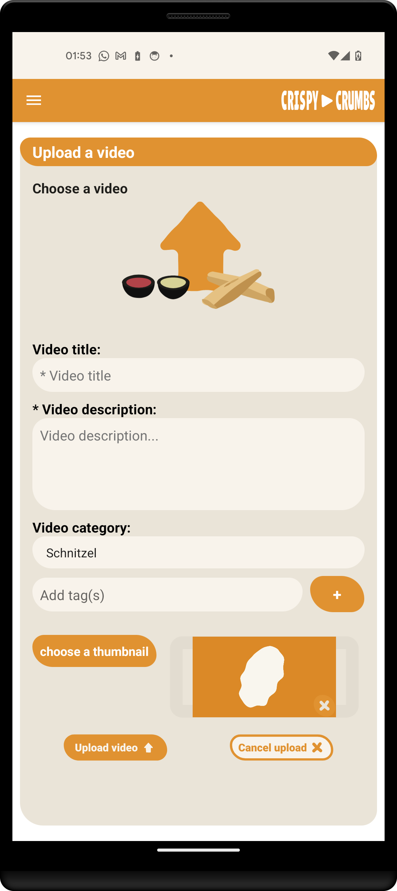
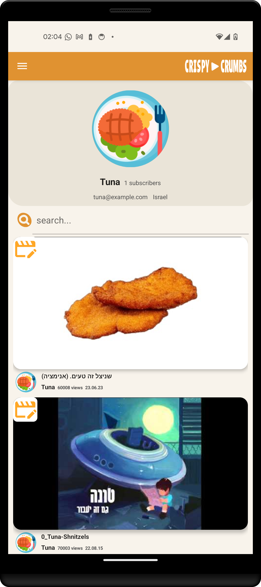
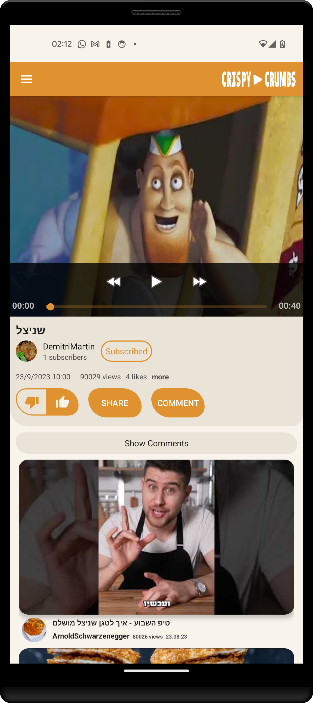

For the app to run properly first go through the basic setup file and in particularly that the server IP address is updated in the app.

You're free to enjoy the app immediately. 

## Sign up

For more personalized experience and additional functionality sign up by:
- open the side menu

- go to `Sign up`

- fill in your details

## Log in

If you have a CrispyCrumbs user. (Like **Username**: "Tuna"; **Password**: "password6".)
You can log in by:
- open the side menu
- go to `Log in`
- fill in your details

## Upload video

- go to `Upload Video` in the side menu
- choose a video file and describe it

## Edit / Delete video

First see your uploaded videos in `Profile` in the side menu.
Here you can press the edit icon on any video to edit it.

Now you can change any detail you like and update or to delete the video from the community database.

## Watch video

You can  find a crispy video in many parts of the app, like the home page suggestions, a free search, in every uploading user profile page and even from the video player page.

After clicking a desired video you will get to the video player page where you can watch it, interact with it like by liking and commenting, and find the next video to watch from a personal recommendation.  

