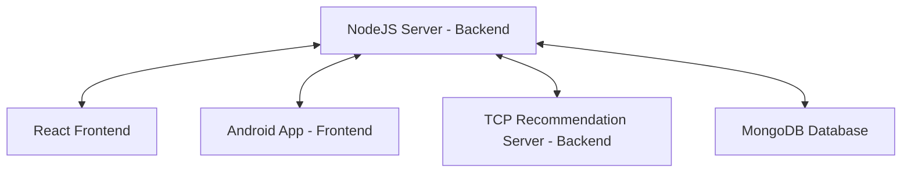

# Crispy Crumbs: Full Project Setup Guide

## Setting Up Crispy Crumbs: Overview

The **Crispy Crumbs** platform consists of multiple components:

1. **Node.js Server**: The main backend server.
2. **TCP Recommendation Server**: A C++ server that provides personalized video recommendations.
3. **React Website**: A web version of the Crispy Crumbs platform.
4. **Android App**: The mobile version of the Crispy Crumbs platform.

To get the full experience, follow these steps to set up each component properly.



### Prerequisites for All Components

- **Windows Machine**: The server and website are tested on Windows.
- **Node.js**: Required for running the backend server and the website.
- **MongoDB**: Used as the database for storing user and video data.
- **C++ Compiler**: A compiler that supports C++20 or later (e.g., GCC, Clang, MSVC).
- **Android Studio**: Version 2023.3.1 (Jellyfish) or later to run the Android app.
- **Make** (optional): To build the TCP server using a Makefile.

## Step 1: Setting Up the Node.js Server

### 1.1 Prerequisites

- Node.js
- MongoDB: By default, Crispy Crumbs will use the "CrispyCrumbs" database in `mongodb://localhost:27017/CrispyCrumbs` **and will overwrite anything in it**.
- TCP Recommendation Server: Necessary for video recommendations. Activate the [C++ TCP Server](https://github.com/Mzhenian/CrispyCrumbsTCP) before starting the Node.js server.


### 1.2 Download the Server

- Clone the repository from GitHub: [CrispyCrumbsServer](https://github.com/Mzhenian/CrispyCrumbsServer)
  ```bash
  git clone https://github.com/Mzhenian/CrispyCrumbsServer.git
  ```

### 1.3 Initialization Option One: Easy & Fast Script

1. Open a command prompt in the `CrispyCrumbsServer` project folder.
2. Run the initialization script:
   ```
   .\init_server.cmd
   ```
3. You may update the JWT secret if prompted.
4. After initialization, use `npm start` to start the server.

### 1.4 Initialization Option Two: Manually

#### JWT Secret Configuration

1. Open `CrispyCrumbsServer\config\config.js` and replace the JWT secret with your desired key:
   ```javascript
   module.exports = {
       jwtSecret: 'your-jwt-secret-here',
   };
   ```

#### MongoDB Setup

1. Open MongoDB Compass.
2. Connect to the URI `mongodb://localhost:27017/CrispyCrumbs`.
3. Create a database named `CrispyCrumbs` with collections `users` and `videos`.
4. Import data for users and videos from `FilesForMongoDB`.
5. Create indexes for efficient querying.


#### Starting the Server

1. Open a terminal in the `CrispyCrumbsServer` project folder.
2. Run `npm install`.
3. **Activate the TCP Server** as described in the next section.
4. Run the server:
   ```
   node server.js
   ```

## Step 2: Setting Up the TCP Recommendation Server

### 2.1 Prerequisites

- **C++ Compiler**: GCC, Clang, or MSVC supporting C++20.

### 2.2 Download and Build

- Clone the repository from GitHub: [CrispyCrumbsTCP](https://github.com/Mzhenian/CrispyCrumbsTCP)
  ```bash
  git clone https://github.com/Mzhenian/CrispyCrumbsTCP.git
  ```

- Navigate to the project directory:
  ```bash
  cd CrispyCrumbsTCP
  ```

- Build the server using Make (optional):
  ```bash
  make
  ```
  This command will generate `server.out` but will not run it. To build and run the server, use:
  ```bash
  make test
  ```

### 2.3 Running the Server

- Run the server:
  ```bash
  ./server.out
  ```

  The TCP server running logs


- Ensure that the TCP server is running before starting the Node.js server.

The NodeJS running


## Step 3: Running the Crispy Crumbs Web Version

### 3.1 Prerequisites

- **Node.js**
- **Crispy Crumbs Node.js Server**: The backend server must be set up and running before the website can function correctly.

### 3.2 Download the Web Version

- Clone or download the [CrispyCrumbsWeb](https://github.com/Mzhenian/CrispyCrumbsWeb) repository.

### 3.3 Initialization Option One: Easy & Fast Script

1. Place both `CrispyCrumbsWeb` and `CrispyCrumbsServer` in the same parent directory.
2. Open a command prompt in the `CrispyCrumbsWeb` folder.
3. Run:
   ```
   .\init_website.cmd
   ```
4. Wait for the website to open at [http://localhost:3000](http://localhost:3000).

### 3.4 Manual Setup

1. Ensure the Node.js server is running.
2. Open a terminal in the `CrispyCrumbsWeb` project folder.
3. Run `npm install` and then `npm start`.
4. The website will open at [http://localhost:3000](http://localhost:3000).


## Step 4: Running the Crispy Crumbs Android App

### 4.1 Prerequisites

- **Android Studio**: Version 2023.3.1 or later.
- **Node.js Server** and **TCP Server** must be set up and running.

### 4.2 Download and Run the App

- Clone or download the [CrispyCrumbsAndroid](https://github.com/Mzhenian/CrispyCrumbsAndroid) repository.
- Open the project in Android Studio.

### 4.3 Connecting Your Android Device

You can run the app in two ways:

1. **Install the APK**: Download the APK from the release section.
2. **Use Android Studio**: Connect your device via USB or Wi-Fi. Make sure debugging is enabled in developer options, then click "Run" in Android Studio.

### 4.4 Setting the Server IP in the App

1. Ensure both your Android device and the computer running the server are on the same local network.
2. Open the Crispy Crumbs app.
3. Open the navigation menu and select **Set Server IP**.


5. Enter the **IP address** of the computer running the server.


#### Finding Your Computer's IP Address

- **Windows**: Run `ipconfig` in the Command Prompt.
- **Linux**: Run `hostname -I` in a terminal.
- **macOS**: Run `ifconfig` in Terminal.


Have Fun!

