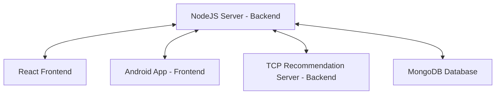
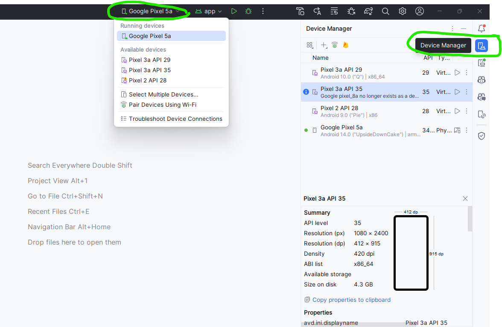

# Crispy Crumbs: Full Project Setup Guide

## Setting Up Crispy Crumbs: Overview

The **Crispy Crumbs** platform consists of multiple components:

1. **Node.js Server**: The main backend server.
2. **TCP Recommendation Server**: A C++ server that provides personalized video recommendations.
3. **React Website**: A web version of the Crispy Crumbs platform.
4. **Android App**: The mobile version of the Crispy Crumbs platform.

To get the full experience, follow these steps to set up each component properly.



### Prerequisites for All Components

- **Windows Machine with WSL2**: The NodeJS server and website are tested on Windows, the recommendation (TCP) server is tested on WSL2 (ubuntu).
- **Node.js**: Required for running the backend server and the website.
- **MongoDB**: Used as the database for storing user and video data.
- **C++ Compiler**: A compiler that supports gnu++ (the linux superset of C++20) or later (e.g., GCC, Clang, MSVC).
- **Android Studio** (optional): Version 2023.3.1 (Jellyfish) or later to Sync Gradle and build the app.
- **Make** (optional): To build the TCP server using a Makefile.


## Step 1: Setting Up the TCP Recommendation Server

### 1.1 Prerequisites

- **C++ Compiler**: GCC, Clang, or MSVC supporting gnu++20.

### 1.2 Download and Build

- Clone the repository from GitHub: [CrispyCrumbsTCP](https://github.com/Mzhenian/CrispyCrumbsTCP)

  ```bash
  git clone https://github.com/Mzhenian/CrispyCrumbsTCP.git
  ```

  - Checkout the latest released version.

- Navigate to the project directory:

  ```bash
  cd CrispyCrumbsTCP
  ```

- Build the server using Make (optional):

  ```bash
  make
  ```
  
  This command will generate `server.out` but will not run it. To build and run the server, use:

  ```bash
  make test
  ```

### 1.3 Running the Server

- Run the server:

  ```bash
  ./server.out
  ```

  The TCP server running logs


- Ensure that the TCP server is running before starting the Node.js server.

The NodeJS running


## Step 2: Setting Up the Node.js Server

### 2.1 Prerequisites

- Node.js
- MongoDB: By default, Crispy Crumbs will use the "CrispyCrumbs" database in `mongodb://localhost:27017/CrispyCrumbs` **and will overwrite anything in it**.
- TCP Recommendation Server: Necessary for video recommendations. Activate the [C++ TCP Server](https://github.com/Mzhenian/CrispyCrumbsTCP) before starting the Node.js server.

### 2.2 Download the Server

- Clone the repository from GitHub: [CrispyCrumbsServer](https://github.com/Mzhenian/CrispyCrumbsServer)

  ```
  git clone https://github.com/Mzhenian/CrispyCrumbsServer.git
  ```

- Checkout the latest released version.

### 2.3 Initialization Option One: Easy & Fast Script

1. Open a command prompt in the `CrispyCrumbsServer` project folder.
2. Run the initialization script:

   ```
   .\init_server.cmd
   ```

3. You may update the JWT secret if prompted.

- **Note** it's only necessary to initialize the server once. In the future, to start the server without modifying the config files and database, run `npm start` to start the server.

- The script accept the flag `-force` to restart the server.

### 2.4 Initialization Option Two: Manually

#### JWT Secret Configuration

1. Open `CrispyCrumbsServer\config\config.js` and replace the JWT secret with your desired key:

   ```javascript
   module.exports = {
       jwtSecret: 'your-jwt-secret-here',
   };
   ```

#### MongoDB Setup

1. Open MongoDB Compass.
2. Connect to the URI `mongodb://localhost:27017/CrispyCrumbs`.
3. Create a database named `CrispyCrumbs` with collections `users` and `videos`.
4. Import data for users and videos accordingly from `FilesForMongoDB`.
5. Create indexes to enable in-app search.


#### Starting the Server

1. Open a terminal in the `CrispyCrumbsServer` project folder.
2. Run `npm install`.
3. **Activate the TCP Server** as described previously.
4. Run the server:

   ```
   node server.js
   ```

## Step 3: Running the Crispy Crumbs Web Version

### 3.1 Prerequisites

- **Node.js**
- **Crispy Crumbs Node.js Server**: The backend server must be set up and running before the website can function correctly.

### 3.2 Download the Web Version

-download the latest released version of [CrispyCrumbsWeb](https://github.com/Mzhenian/CrispyCrumbsWeb) repository.

- Or clone the entire repository and checkout the latest released version.

### 3.3 Initialization Option One: Easy & Fast Script

1. Insure both `CrispyCrumbsWeb` and `CrispyCrumbsServer` in the same parent directory.
2. Open a command prompt in the `CrispyCrumbsWeb` folder.
3. Run:

   ```
   .\init_website.cmd
   ```

4. Wait for the website to open at [http://localhost:3000](http://localhost:3000).

### 3.4 Manual Setup

1. Ensure the Node.js server is running.
2. Open a terminal in the `CrispyCrumbsWeb` project folder.
3. Run `npm install` and then `npm start`.
4. The website will open at [http://localhost:3000](http://localhost:3000).


## Step 4: Running the Crispy Crumbs Android App

### 4.1 Prerequisites

- The app is designed to run on Android devices with **Android 10 up to the latest Android 15**
- **Node.js Server** and **TCP Server** must be set up and running for the app to function properly.

### 4.2 Download and run the app

#### option 1)

- download the latest [released APK](https://github.com/Mzhenian/CrispyCrumbsAndroid/releases)
- install it on an android smartphone and run.

#### option 2)

*Requires Android Studio Version 2023.3.1 or later to Sync Gradle and build the app.

- Clone or download the latest [CrispyCrumbs Android](https://github.com/Mzhenian/CrispyCrumbsAndroid) repository [complete branch](https://github.com/Mzhenian/CrispyCrumbsAndroid/branches/all?query=complete) .
- Open the project in Android Studio.
- In it from one of the menus marked below, choose on which device to run the app. Either connect your physical device via USB or Wi-Fi. (Make sure debugging is enabled in developer options.) Or use an emulator.
- 
- then click "Run".

### 4.3 Setting the Server IP in the App

To allow the app to connect to the (NodeJS) server on dynamic IP the user can configure the server IP address on run time:

1. Ensure both your Android device and the computer running the NodeJS server are connected to the same local network.
2. [Find the server's IP Address](#finding-your-computers-ip-address)
3. Open the Crispy Crumbs app.
4. Open the navigation menu and select **Set Server IP**.


5. Enter the **IP address** of the computer running the server.


#### Finding Your Computer's IP Address

##### On Windows:

1. Open the **Command Prompt** by pressing `Windows Key + R`, typing `cmd`, and pressing Enter.
2. In the Command Prompt, type the following command and press Enter:

    ```
    ipconfig
    ```

3. Look for the section called **Wireless LAN adapter Wi-Fi** or **Ethernet adapter**. The **IPv4 Address** listed there is your computer's IP address (e.g., `192.168.1.100`).

##### On Linux:

1. Open a terminal.
2. Type the following command and press Enter:

    ```
    hostname -I
    ```

##### On macOS:

1. Open the **Terminal**. You can find it by searching for "Terminal" in Spotlight (`Command + Space`).

2. In the terminal, type the following command and press Enter:

    ```
    ifconfig
    ```


Have Fun!
